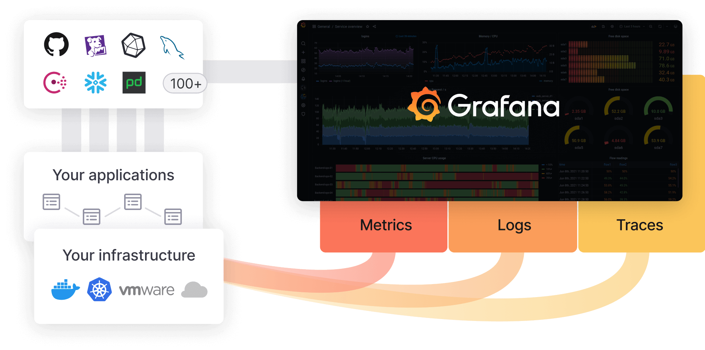

<!-- _backgroundImage: url('imagens/ppt-business-613.jpg') -->
<!-- _paginate: false  -->
#

# Monitoramento de Aplicações com ferramentas **OpenSource**
---

#
 
  ### Baixe esta apresentação!

---

###  Jeovany Batista da Silva

* Analista Linux na 4Linux
* Consultor de tecnologia para monitoramento
* Gamer 🎮
* Maker 🔨
* Player ⚽
* Adorador de café ☕

---

#
<!-- _paginate: false -->

>#### Só depois que a tecnologia inventou o telefone, o telégrafo, a televisão, a internet, foi que se descobriu que o problema de comunicação mais sério era o de perto.

*Millôr Fernandes*

---

 ### Corre aqui que teremos um sorteio no final!
 
 ###### Não deixe de participar!
Escaneie o QRCode ou [clique aqui!](https://sorteio.4linux.com.br/sorteio-palestra-monitoramento-de-aplicacoes-com-ferramentas-opensource)

---

# Monitoramento de aplicações

*  Necessidades
*  Tecnologia e Processos 
*  Ferramentas OpenSource
    * Prometheus
    * Grafana
  

  
---

# Prometheus

* TSDB - Time Series Data Base
* Coletas de métricas em modelo pull sobre HTTP
* PromQL
* Trabalha com qualquer arquitetura de serviço
* Configuração estática ou com serviços de descobertas para Targets

---

# Grafana
O Grafana permite consultar, visualizar, alertar e explorar suas métricas, logs e rastreamentos, onde quer que estejam armazenados. Fornece ferramentas para transformar seus dados, armazenados em banco de dados de séries temporais (TSDB), em gráficos e visualizações inteligentes.

---

# Vamos ao Laboratório!

Siga-me os bons!

---

# Vamos nos conectar?

#####  jeovanybatista
#####  Jeovany Batista
#####  jeovanybatista

###### Obrigado!!

---

# Referências Bibliográficas

https://prometheus.io/docs/instrumenting/clientlibs/
https://prometheus.io/docs/introduction/overview/
https://grafana.com/
https://grafana.com/oss/grafana/
https://grafana.com/docs/?pg=oss-graf&plcmt=quick-links
https://github.com/prometheus-community/helm-charts/tree/main/charts/kube-prometheus-stack
https://github.com/grafana/helm-charts
